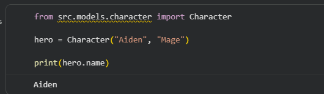
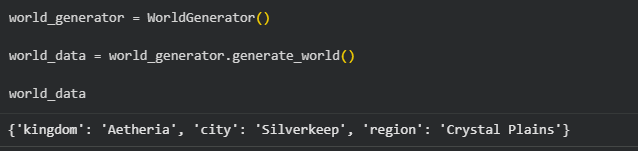
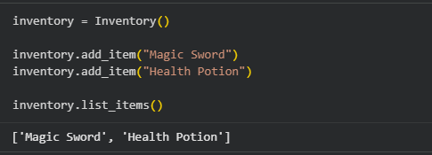
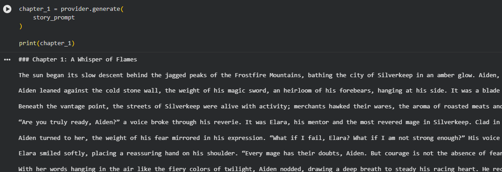
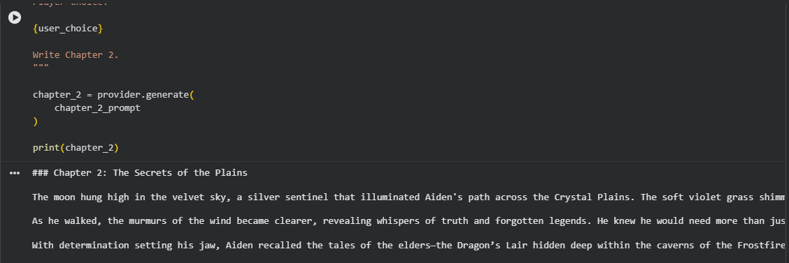
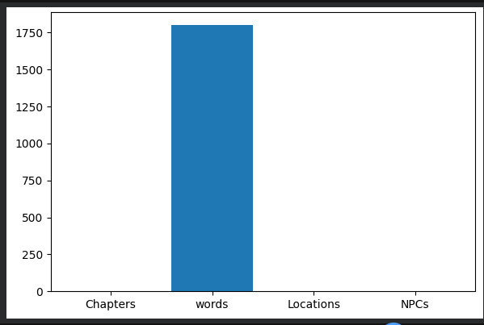
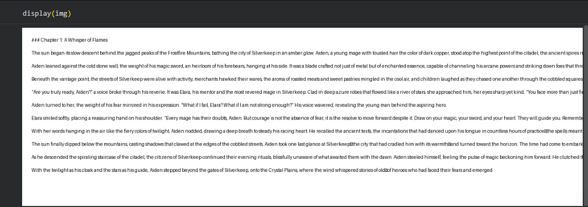

# NarrAIte

AI-Powered Interactive Storytelling Engine built with OpenAI, dynamic world generation, memory systems, quests, NPCs, analytics, and export functionality.

## Overview

NarrAIte is a modular Generative AI storytelling framework that creates interactive narrative experiences. The project combines large language models with game-inspired systems such as character progression, inventory management, quests, NPC interactions, achievements, memory tracking, and story analytics.

The goal of NarrAIte is to demonstrate practical applications of Generative AI beyond simple chat interfaces by building a complete narrative ecosystem.

---

## Features

### AI Story Generation

* OpenAI-powered narrative generation
* Offline fallback support
* Dynamic chapter creation
* Choice-driven storytelling

### Character System

* Custom playable characters
* Character state tracking
* Story progression management

### World Generation

* Dynamic fantasy world creation
* Locations and regions
* Expandable world-building framework

### Quest System

* Quest creation and management
* Story objectives
* Progress tracking

### Inventory System

* Item management
* Persistent inventory state
* Story-integrated equipment

### NPC System

* Dynamic NPCs
* Relationship tracking
* NPC memory support

### Achievement System

* Unlockable achievements
* Progress milestones

### Memory System

* Story history tracking
* Context persistence between chapters

### Analytics Dashboard

* Chapter statistics
* Word counts
* Location tracking
* NPC interaction metrics

### Export Functionality

* TXT export
* PDF export
* Markdown export

---

## Screenshots

### Character Creation



### World Generation



### Inventory System



### Chapter 1 Generation



### Chapter 2 Generation



### Analytics Dashboard



### Portfolio Summary



---

## Project Structure

```text
NarrAIte/
├── notebooks/
├── src/
├── tests/
├── assets/
├── docs/
├── examples/
├── exports/
├── saves/
├── README.md
├── requirements.txt
└── LICENSE
```

---

## Installation

```bash
git clone https://github.com/sammysamad402/NarrAIte.git

cd NarrAIte

pip install -r requirements.txt
```

---

## Environment Variables

Create a `.env` file:

```env
OPENAI_API_KEY=your_api_key_here
```

---

## Running the Project

Open:

```text
notebooks/NarrAIte_Main.ipynb
```

Run all notebook cells to generate:

* Dynamic worlds
* Characters
* Quests
* Inventory
* AI-generated story chapters
* Analytics
* Exports

---

## Testing

```bash
pytest tests -v
```

Current Status:

```text
8/8 Tests Passing
```

---

## Tech Stack

* Python
* OpenAI API
* SQLite
* JSON Storage
* Jupyter Notebook
* Google Colab
* PyTest
* ReportLab
* Matplotlib

---

## Future Improvements

* Multi-provider AI support
* Branching story trees
* Advanced NPC intelligence
* Visual world maps
* Web interface
* Multiplayer storytelling

---

## Author

Abdul Samad Shaikh
Bachelor of Engineering -I.T

GitHub:
https://github.com/sammysamad402
